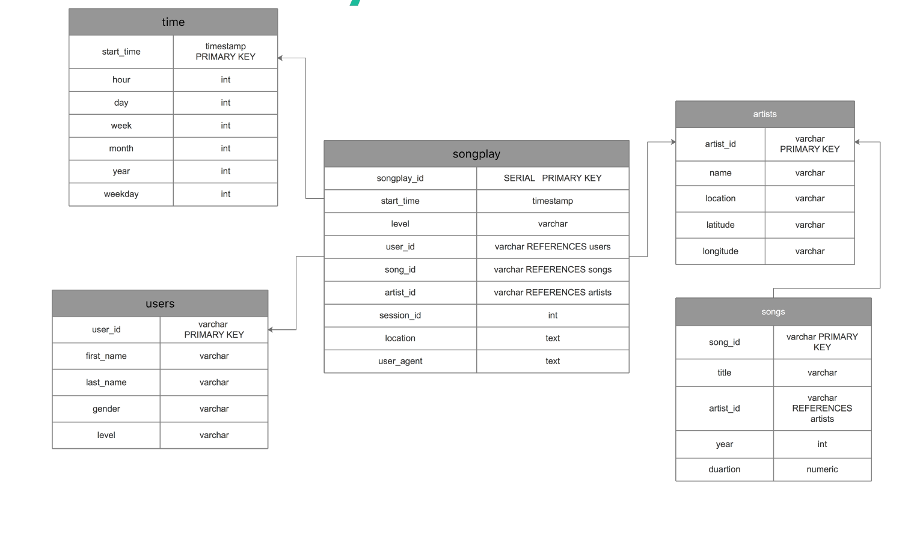
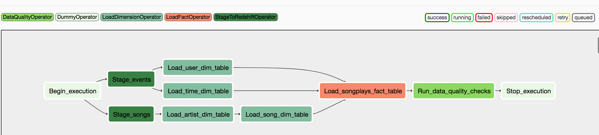

# Sparkify-DWH-Airflow

This folder contains the necessary program files to create airflow pipelines to load data from S3 to sparkify redshift database.

## Contents

1.create_tables.py
    * create table scripts to create the tables.
3. README.md    
4. images
    * images used in the presentation.
5. dags
    * sparkify_etl_dag.py
6. plugins
    * helpers
    * operators


## Installation

1. Use the following command to clone the project repository.

    ```
    git clone https://github.com/shilpamadini/airflow-sparkify.git
    ```

2. This project needs a ready installation of redshift. Please refer [AWS redshift documentation](https://docs.aws.amazon.com/redshift/latest/mgmt/welcome.html) to  learn how create redshift cluster. This project also requires an installation of airflow to run the DAG. Here is a [good reference](https://blog.godatadriven.com/practical-airflow-tutorial), I found to help with airflow installation. [Apache Airflow](https://airflow.apache.org/docs/stable/tutorial.html) also has lot of documentation on airflow.

## Functionality

A music streaming company, Sparkify, has decided that it is time to introduce more automation and monitoring to their data warehouse ETL pipelines and come to the conclusion that the best tool to achieve this is Apache Airflow.

 This projects aims to build a high grade data pipelines that are dynamic and built from reusable tasks, can be monitored, and allow easy backfills.Since data quality plays a big part when analyses are executed on top the data warehouse and data quality checks are included in the pipeline that run tests against the loaded datasets after the ETL steps have been executed.

The source data resides in S3 and needs to be processed in Sparkify's data warehouse in Amazon Redshift. The source datasets consist of JSON logs that tell about user activity in the application and JSON metadata about the songs the users listen to.Since the analytics team is interested in knowing what songs the users are listening to and probably interested in performing ranking ,aggregation to determine which song is played the most, what is most popular song, which artist released most popular songs. Analytics may also be interested in looking at the trends over a period of time.

In order to support the required analytics a star schema design is implemented to design the data warehouse. songplay table is the fact table and song, user,artist and time are dimension tables. Database integrity is maintained by using Primary key and foreign key constraints in the table definitions.

Here is the ER diagram explaining the schema design.



 Airflow data pipelines are designed and dependency of the tasks is set considering the database referential integrity. Based on the above ER diagram fact table songplays is loaded after loading all the dimension tables.Below is the snapshot of the Airflow DAG representing the tasks and their dependencies.
 
 Dags are designed using custom operators that are reused in the pipeline for similar functionality. The stage operator is expected to be able to load any JSON formatted files from S3 to Amazon Redshift.Both dimension and fact operators, include SQL helper class to run data transformations. Most of the logic is within the SQL transformations and the operator takes SQL statement and target table names as inputs to complete the load. Data quality operator also takes table name and performs predefined set of quality checks on the that table
